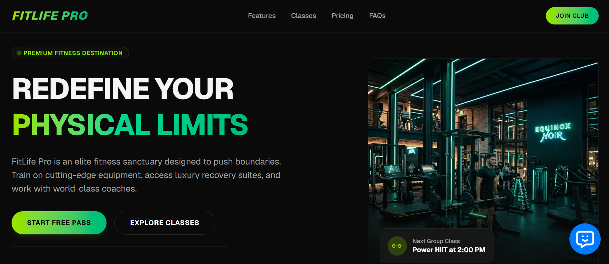
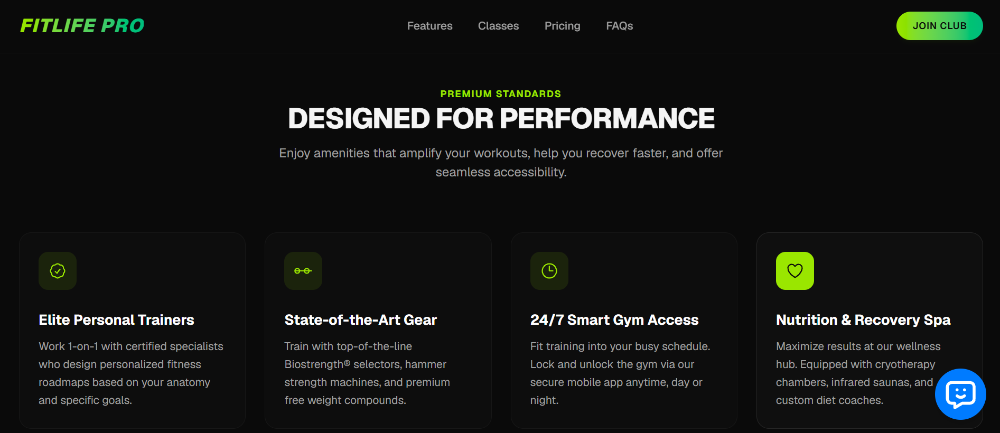
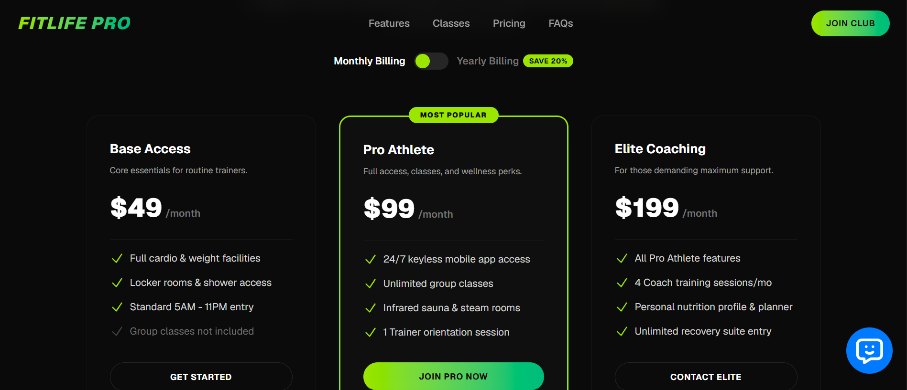

# FitLife Pro 🏋️‍♂️✨

**FitLife Pro** is a modern, high-performance, and visually premium landing page for an elite fitness sanctuary. Built with a stunning dark-mode aesthetic, harmonious gradient accents, and responsive layout designs, it showcases classes, trainers, pricing plans, and frequently asked questions. 

To provide a state-of-the-art customer experience, the application features an integrated, AI-powered digital chat assistant trained on the gym's specific operations, class schedules, pricing, and policies.

## 📸 Previews

|  |
| :---: |
| _FitLife Pro - Hero Section & Key Features_ |

|  |  |
| :---: | :---: |
| _Class Programs & Filters_ | _Membership Plans, FAQs & AI Assistant_ |

---

## 🌟 Key Features

### 1. Elite Landing Page
- **Hero Area**: Sleek design featuring custom imagery (`/gym_hero.png`), dynamic stats panel, and call-to-actions.
- **Amenities & Features**: Quick breakdown of premium features (certified trainers, 24/7 keyless access, recovery spa).
- **Interactive Class Schedule**: Interactive filter tabs (Strength, Cardio, Recovery, All) for users to browse signature classes.
- **Flexible Pricing Switcher**: Interactive toggle to switch pricing tiers between monthly and yearly billing (offering a 20% discount).
- **FAQ Accordion**: Clean interactive FAQ search/accordion layout.
- **Premium Aesthetics**: Pure CSS animations, glassmorphism, responsive navigation drawer for mobile users, and a tailored color palette featuring HSL-curated lime green (`text-lime-400`) and emerald gradients.

### 2. Intelligent AI Chatbot Integration
- Powered by the `@quickstart-ai/chatbot` library.
- Access token configured: `A1ED-AFEFD52F-3233B0D3`.
- Persistent, site-wide access rendered safely via client-side wrapper.

### 3. Custom API Proxy (`/api/chatbot-proxy`)
- In `src/components/ChatBotWrapper.tsx`, the application dynamically patches the browser's `window.fetch` to intercept outgoing LLM requests to `https://text.pollinations.ai`.
- Intercepted requests are transparently redirected to the internal API route: `/api/chatbot-proxy?url=<target_url>`.
- The proxy server-side handler (`src/app/api/chatbot-proxy/route.ts`) proxies the requests and forwards responses. This solves client-side CORS issues, provides room for audit logs, and secures direct vendor communication.
- Console warnings generated by styled-components/DOM attributes inside third-party scripts are automatically suppressed for a clean browser console.

---

## 🛠️ Technology Stack

- **Framework**: [Next.js](https://nextjs.org/) (App Router, Client/Server Components)
- **UI Logic**: [React 19](https://react.dev/) & [TypeScript](https://www.typescriptlang.org/)
- **Styling**: [Tailwind CSS v4](https://tailwindcss.com/) with PostCSS
- **Chat Engine**: `@quickstart-ai/chatbot`

---

## 📂 Project Structure

```text
├── .git/                      # Git repository metadata
├── previews/                  # Project screenshots and design previews
│   ├── 1.png
│   ├── 2.png
│   └── 3.png
├── public/                    # Static assets
│   ├── gym_hero.png           # Premium landing page hero image
│   └── *.svg                  # Boilerplate graphics
├── src/
│   ├── app/
│   │   ├── api/
│   │   │   └── chatbot-proxy/
│   │   │       └── route.ts   # GET & POST proxy handlers for LLM requests
│   │   ├── favicon.ico
│   │   ├── globals.css        # Global styles & Tailwind v4 configurations
│   │   ├── layout.tsx         # Main entry shell containing ChatBotWrapper
│   │   └── page.tsx           # Home landing page page logic
│   └── components/
│       ├── ChatBot.tsx        # Dynamic client import wrapper
│       └── ChatBotWrapper.tsx # Global interceptor and chatbot mount
├── fitlife_chatbot_config.txt # System Q&A configurations & brand details
├── package.json               # Dependencies and build scripts
└── tsconfig.json              # TypeScript compilation setup
```

---

## 🚀 Getting Started

### Prerequisites
Make sure you have [Node.js](https://nodejs.org/) installed (version 18+ recommended).

### 1. Install Dependencies
Run the following command in the root folder of the project to install all node modules:
```bash
npm install
```

### 2. Run in Development Mode
Start the local development server:
```bash
npm run dev
```
Open [http://localhost:3000](http://localhost:3000) in your browser to view the application.

### 3. Build for Production
To build a production-optimized bundle:
```bash
npm run build
```
To run the production build locally:
```bash
npm run start
```

---

## 🤖 Chatbot Config & Training Data

The chatbot’s specialized domain training is outlined in `fitlife_chatbot_config.txt`. This file details the mock account profile (John Doe) and **12 detailed Q&As** that govern the assistant's knowledge base. It is configured to answer member inquiries about:
1. What FitLife Pro is.
2. Gym hours (24/7 keyless mobile entry).
3. The Pro Athlete membership tier benefits ($99/mo standard).
4. Free trial / guest pass availability (complimentary 3-day pass).
5. Signature group classes.
6. How to book personal training sessions.
7. Wellness recovery amenities (cryotherapy, saunas, steam rooms).
8. Member parking garage facilities.
9. Cancellation & freezing policies (15-day notice, no contracts).
10. Nutrition coaching add-ons.
11. Age requirements (18+, or 16-17 with parental consent).
12. Luxury locker rooms & shower services.